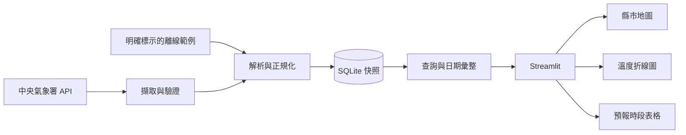

# Taiwan Weather Forecast｜台灣天氣預報地圖

以中央氣象署（CWA）開放資料建立可查詢縣市、日期與溫度趨勢的互動式天氣地圖，同時保留可教學、可測試、可維護的資料處理流程。

**目前狀態：規畫階段。** 本儲存庫目前只有規畫文件，尚未實作資料串接、應用程式或部署；參考網站不是本專案的成果。

## 專案方向

第一階段沿用課程圖片的 Python → JSON → SQLite → Streamlit 路線，完成「縣市一週預報」MVP。介面參考 [台灣即時氣象地圖](https://taiwan-weather-map.vercel.app/) 的地圖、圖層與圖例概念。

兩個參考的資料性質不同：網站主題是即時觀測，課程圖片是未來預報。本專案先處理未來預報，之後再以獨立資料來源與時間標示加入即時觀測。地圖上的縣市代表點不等同於測站，也不代表每個地點的實測值。

## MVP 使用流程

1. 開啟頁面，看到資料來源、最後成功更新時間與資料狀態。
2. 選擇縣市及資料實際涵蓋的日期，查看當日預報最高／最低溫。
3. 查看最多七個可用日期的溫度折線圖，以及原始預報時段表格。
4. 在台灣地圖上查看同一天各縣市的溫度標記與圖例；點擊代表點查看明細。
5. 更新失敗時保留最後成功資料並顯示過期狀態；沒有資料時提供明確提示。

## 範圍與優先順序

| 階段 | 功能 | 完成判定 |
| --- | --- | --- |
| P0：MVP | CWA 預報擷取、JSON 正規化、SQLite、縣市／日期篩選、最高最低溫、折線圖、表格、地圖 | 資料可追溯；相同篩選在各視圖一致；重複匯入不增加重複資料 |
| P0：品質 | 離線示範、缺值與錯誤處理、資料時間、API Key 管理、自動化測試 | 不使用 Key 也能測試；示範資料明確標示；失敗不覆蓋有效資料 |
| P1：體驗 | 縣市界線、底圖切換、定位、CSV 匯出、進階手機操作 | 個別功能有驗收案例後再實作 |
| P2：擴充 | 即時氣溫／雨量／風／濕度／雷達／颱風圖層、通知、AI 摘要 | 先確認各資料源、時間語意、授權及維運成本 |

MVP 不包含帳號、付費功能、氣象預測模型、自動通知或全部圖層重製。AI 初期用於輔助開發；產生天氣摘要是後續選配功能。

## 技術規畫

| 層次 | 初期選擇 | 用途 |
| --- | --- | --- |
| 資料擷取 | Python、Requests | 有逾時與重試策略的 CWA API 存取 |
| 資料處理 | Python、Pandas | 驗證、欄位對應、時段對齊與查詢結果整理 |
| 儲存 | SQLite | 本機與單一執行個體的預報快照 |
| 介面 | Streamlit、Folium、streamlit-folium | 篩選、折線圖、表格、互動地圖 |
| 驗證 | pytest、Ruff、GitHub Actions | 解析與資料一致性測試、程式品質檢查 |
| 發布 | 先本機，後評估 Streamlit Community Cloud | 先完成可重現的 MVP，再部署示範 |

版本與相依套件會在建立可執行骨架時驗證並鎖定。SQLite 隨 Python 提供，不另安裝同名套件。若後續需要接近參考網站的全螢幕圖層體驗，再評估 Next.js／Leaflet 前端與獨立 API。

候選資料集為 `F-D0047-091`，中央氣象署文件列為「臺灣未來1週天氣預報」。實作前必須以實際回應驗證欄位、縣市涵蓋範圍、時間區間及單位，不直接將圖片中的示意 JSON 當成 API 契約。參閱 [CWA API 文件](https://opendata.cwa.gov.tw/dist/opendata-swagger.html)。

## 開發里程碑

| 里程碑 | 交付內容 | 狀態 |
| --- | --- | --- |
| M0：規畫 | README、需求與驗收、架構與資料設計、參考分析 | 已完成文件初稿 |
| M1：資料契約 | 無 Key 的回應範例、欄位對照、解析器、離線測試 | 待開發 |
| M2：資料管線 | 擷取、SQLite migration、冪等匯入、失敗回復 | 待開發 |
| M3：查詢介面 | 縣市／日期選單、摘要、折線圖、表格與狀態提示 | 待開發 |
| M4：互動地圖 | 縣市代表點、圖例、點擊明細、手機與桌面驗收 | 待開發 |
| M5：品質與發布 | CI、設定說明、部署驗證、操作文件 | 待開發 |

各階段以驗收通過為完成依據，不以檔案建立或畫面出現取代驗收。完整任務與依賴見 [開發計畫](docs/PLAN.md)。

## 文件導覽

- [開發計畫與驗收標準](docs/PLAN.md)：需求編號、工作拆分、風險及完成定義。
- [架構與資料設計](docs/ARCHITECTURE.md)：模組責任、資料契約、資料表、更新與部署策略。
- [參考分析與設計決策](docs/REFERENCES.md)：網站及課程圖片的取捨與查核限制。

## 執行與協作

目前沒有可執行程式或安裝指令。完成 M1／M2 後會補上經驗證的環境、安裝、資料初始化與啟動步驟；不得把規畫中的指令宣稱為已可執行。

開發採小幅提交；功能開發使用分支與 PR，連結需求編號並說明驗證結果。CI 在程式骨架建立時加入，預設以離線 fixtures 執行，不依賴真實 API Key。

未來使用 `CWA_API_KEY` 環境變數或 Streamlit secrets。Key、`.env`、`.streamlit/secrets.toml`、SQLite 執行檔及未處理的 API 日誌不得提交至 Git；建立程式骨架時一併加入 `.gitignore`。部署密鑰方式依 [Streamlit 官方說明](https://docs.streamlit.io/deploy/streamlit-community-cloud/deploy-your-app/secrets-management)。

Streamlit Community Cloud 不保證本機檔案持久保存，因此示範部署的 SQLite 必須可重新建立；需要保存歷史資料時，改用持久磁碟或外部資料庫。參閱 [官方資料連線說明](https://docs.streamlit.io/develop/concepts/connections/connecting-to-data)。

資料畫面須標示中央氣象署來源、預報有效期間、擷取時間與示範／真實模式。底圖與地理資料須保留各自的來源及授權標示。
