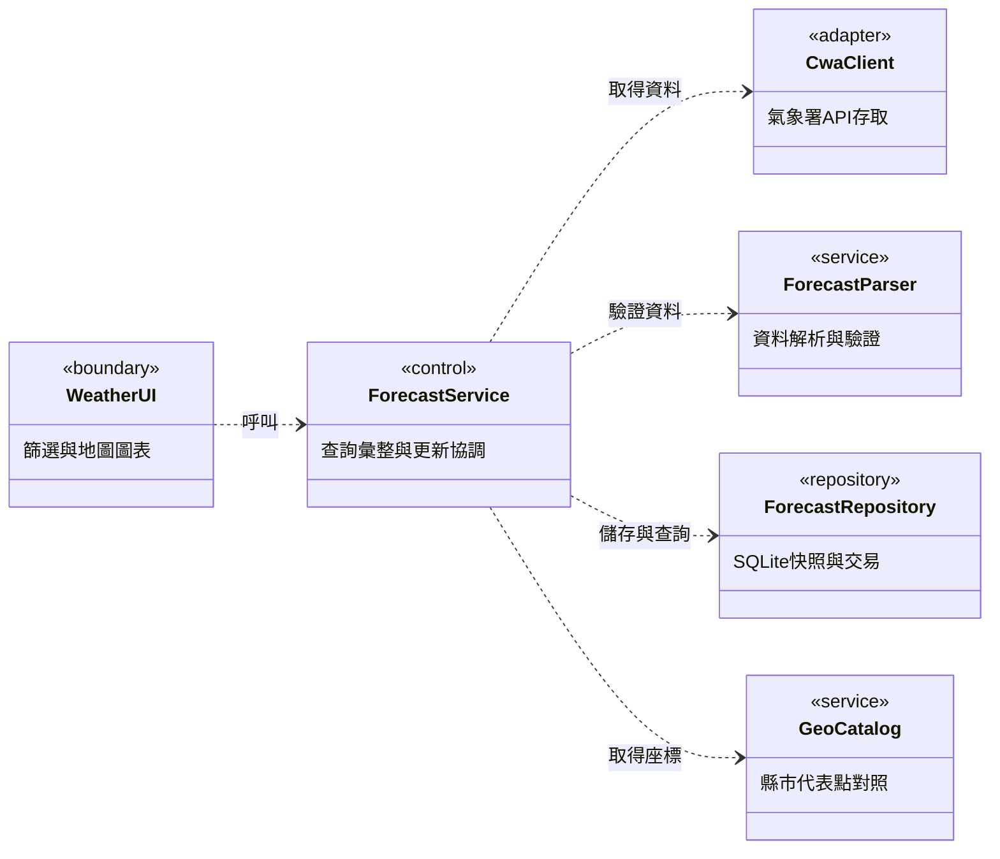

# Taiwan Weather Forecast｜台灣天氣預報地圖

以中央氣象署（CWA）開放資料建立可查詢縣市、日期與溫度趨勢的互動式天氣地圖，同時保留可教學、可測試、可維護的資料處理流程。

**目前狀態：已部署 Streamlit Community Cloud，真實 CWA → SQLite → 查詢介面已接通。** 可選縣市／日期，查看最低最高溫、七日趨勢、預報時段及互動地圖；具真實／Demo 模式、過期提示與更新失敗保留。官方溫度缺值語意、雲端復原與實體手機驗收仍待補齊。詳見 [最新進度](docs/PROGRESS.md)。

## 立即查看成果

公開網站：[台灣一週天氣 · mysoul](https://mysoul-9hyuk7z9oawbtdzjx2u3s4.streamlit.app/)。訪客不需輸入 API Key。

若要在本機執行，在專案目錄輸入：

```powershell
uv sync --locked
uv run --locked streamlit run app.py --server.address 127.0.0.1
```

開啟 <http://localhost:8501>。Windows 安裝套件後亦可雙擊 `start-dashboard.cmd`。
首次沒有資料時，左側選「Demo 示範」→「載入示範資料」即可操作，不需 Key。
Demo 固定日期 2026/12/31–2027/01/01，是合成範例；真實模式只讀取 live 資料。
手機窄螢幕使用左上角箭頭展開查詢選單。以上啟動指令只開放本機；公開版本使用上方 Cloud 網址。

要更新真實天氣，請依 [本機設定](docs/LOCAL_SETUP.md) 設定伺服器端金鑰，或先用
`uv run --locked weather-data update-live --prompt-key` 更新資料庫後重新整理頁面。
地圖底圖需要網路；關閉底圖仍可使用代表點、選單與表格。

## 專案方向

第一階段沿用課程圖片的 Python → JSON → SQLite → Streamlit 路線，完成「縣市一週預報」MVP。介面參考 [台灣即時氣象地圖](https://taiwan-weather-map.vercel.app/) 的地圖、圖層與圖例概念。

兩個參考的資料性質不同：網站主題是即時觀測，課程圖片是未來預報。本專案先處理未來預報，之後再以獨立資料來源與時間標示加入即時觀測。地圖上的縣市代表點不等同於測站，也不代表每個地點的實測值。

## MVP 使用流程

1. 開啟頁面，看到資料來源、最後成功更新時間與資料狀態。
2. 選擇縣市及資料實際涵蓋的日期，查看當日預報最高／最低溫。
3. 查看最多七個可用日期的溫度折線圖，以及原始預報時段表格。
4. 在台灣地圖上查看同一天各縣市的溫度標記與圖例；點擊代表點查看明細。
5. 更新失敗時保留最後成功資料並顯示過期狀態；沒有資料時提供明確提示。

## 範圍與優先順序

| 階段 | 功能 | 完成判定 |
| --- | --- | --- |
| P0：MVP | CWA 預報擷取、JSON 正規化、SQLite、縣市／日期篩選、最高最低溫、折線圖、表格、地圖 | 資料可追溯；相同篩選在各視圖一致；重複匯入不增加重複資料 |
| P0：品質 | 離線示範、缺值與錯誤處理、資料時間、API Key 管理、自動化測試 | 不使用 Key 也能測試；示範資料明確標示；失敗不覆蓋有效資料 |
| P1：體驗 | 縣市界線、底圖切換、定位、CSV 匯出、進階手機操作 | 個別功能有驗收案例後再實作 |
| P2：擴充 | 即時氣溫／雨量／風／濕度／雷達／颱風圖層、通知、AI 摘要 | 先確認各資料源、時間語意、授權及維運成本 |

MVP 不包含帳號、付費功能、氣象預測模型、自動通知或全部圖層重製。AI 初期用於輔助開發；產生天氣摘要是後續選配功能。

## 技術規畫

| 層次 | 初期選擇 | 用途 |
| --- | --- | --- |
| 資料擷取 | Python、Requests | 有逾時與重試策略的 CWA API 存取 |
| 資料處理 | Python、Pandas | 驗證、欄位對應、時段對齊與查詢結果整理 |
| 儲存 | SQLite | 本機與單一執行個體的預報快照 |
| 介面 | Streamlit、Altair、Pydeck | 篩選、折線圖、表格、互動地圖 |
| 驗證 | pytest、Ruff、GitHub Actions | 解析與資料一致性測試、程式品質檢查 |
| 發布 | 先本機，後評估 Streamlit Community Cloud | 先完成可重現的 MVP，再部署示範 |

目前 Python 套件支援 3.12～3.14，以 `uv.lock` 鎖定依賴；離線解析器僅使用標準函式庫。Requests 用於 CWA 擷取，Pandas、Streamlit、Altair 與 Pydeck 已加入。SQLite 隨 Python 提供。地圖採內建 Pydeck 選取事件，座標來源見 [代表點說明](docs/MAP_SOURCE.md)。

以下以 UML 類別圖表示主要模組依賴；模組可實作為 Python 函式或類別，不要求全部物件導向化。



完整的模組、資料模型、更新循序與狀態圖見 [UML 系統架構](docs/UML.md)。

候選資料集為 `F-D0047-091`，中央氣象署文件列為「臺灣未來1週天氣預報」。實作前必須以實際回應驗證欄位、縣市涵蓋範圍、時間區間及單位，不直接將圖片中的示意 JSON 當成 API 契約。參閱 [CWA API 文件](https://opendata.cwa.gov.tw/dist/opendata-swagger.html)。

## 開發里程碑

| 里程碑 | 交付內容 | 狀態 |
| --- | --- | --- |
| M0：規畫 | README、需求與驗收、架構與資料設計、UML、參考分析 | 已完成文件初稿 |
| M1：資料契約 | 真實／合成 fixture、欄位對照、解析器與測試 | 三個真實批次及 22 縣市已驗證；缺值語意與更多批次待核對 |
| M2：資料管線 | 擷取、SQLite migration、冪等匯入、失敗回復 | 真實更新／查詢、冷卻、狀態與 JSON 批次日誌完成 |
| M3：查詢介面 | 縣市／日期選單、摘要、折線圖、表格與狀態提示 | 已實作與測試 |
| M4：互動地圖 | 縣市代表點、圖例、點擊明細、手機與桌面驗收 | 基本互動、缺座標保留及地圖失效降級已實作；實機驗收待補 |
| M5：品質與發布 | CI、設定說明、部署驗證、操作文件 | 公開網站查詢已驗收；管理端復原、日誌及實機驗收待完成 |

各階段以驗收通過為完成依據，不以檔案建立或畫面出現取代驗收。完整任務與依賴見 [開發計畫](docs/PLAN.md)。

## 公開部署

部署目標為 **Streamlit Community Cloud**，操作步驟與復原政策見 [部署文件](docs/DEPLOYMENT.md)。
雲端 Secrets 設定 `CWA_API_KEY` 與 `WEATHER_AUTO_REFRESH="true"` 後，開啟或操作頁面時每 30 分鐘檢查更新；
沒有訪客時不會背景排程更新。SQLite 遺失後可由最新 API 回應重建。
實際公開網址與驗收結果以進度文件為準。

## 文件導覽

- [真實資料契約與查詢](docs/LIVE_CONTRACT.md)：live 指令、台灣時間摘要、14／15 時段及缺值限制。
- [最新開發進度](docs/PROGRESS.md)：已完成項目、驗證結果、待辦與使用者需要的設定。
- [開發計畫與驗收標準](docs/PLAN.md)：需求編號、工作拆分、風險及完成定義。
- [架構與資料設計](docs/ARCHITECTURE.md)：模組責任、資料契約、資料表、更新與部署策略。
- [UML 系統架構](docs/UML.md)：模組依賴、領域類別、更新循序與資料狀態。
- [M1 資料契約](docs/DATA_CONTRACT.md)：合成格式、驗證規則、官方欄位依據及真實 API 待辦。
- [參考分析與設計決策](docs/REFERENCES.md)：網站及課程圖片的取捨與查核限制。

## 執行與協作

先安裝 Python 與 uv（本次使用 uv 0.12.21），在儲存庫根目錄執行：

```powershell
python -m pip install uv==0.12.21
uv sync --locked
uv run --locked weather-demo
```

預設 Python 版本為 3.14；uv 會依需求取得相容的 Python。示範不需要 API Key，會輸出含 `DEMO / SYNTHETIC DATA` 標示的 JSON：兩個虛構縣市代碼、四筆預報時段、UTC 時間及缺值旗標。輸出保留 `mode=demo`，不是目前真實天氣。也可用 `uv run --locked python -m weather` 執行。

驗證與建置：

```powershell
uv run --locked pytest
uv run --locked ruff check .
uv run --locked ruff format --check .
uv build
```

測試涵蓋時段亂序、跨年、時區、缺值、重複資料、schema 錯誤與 CLI 模式隔離。GitHub Actions 會在 push／PR 上檢查 Python 3.12、3.13、3.14；執行測試和示範不需要 CWA 網路或密鑰，首次安裝套件仍需網路。

`.env.example` 是設定參考，程式不自動讀取 `.env`。`weather-demo` 僅執行 Demo，設定 `WEATHER_MODE=live` 仍會拒絕；真實更新請明確執行 `weather-data update-live --prompt-key`，失敗不會退回示範。自訂合成範例可用 `weather-demo --fixture <檔案路徑>`。

開發採小幅提交；功能開發使用分支與 PR，連結需求編號並說明驗證結果。CI 已加入，預設以離線 fixtures 執行，不依賴真實 API Key。

`Settings` 已支援 `CWA_API_KEY` 環境變數，並從物件文字表示中隱藏密鑰；Demo 不會使用它發送請求，明確執行 `weather-data capture-cwa` 或 `update-live` 才會連線。`.gitignore` 已排除 `.env`、`.streamlit/secrets.toml`、SQLite、私有原始樣本及日誌；精簡測試氣象資料保留來源並納入版本控制。未來 Streamlit 部署密鑰方式依 [官方說明](https://docs.streamlit.io/deploy/streamlit-community-cloud/deploy-your-app/secrets-management)。

Streamlit Community Cloud 不保證本機檔案持久保存，因此示範部署的 SQLite 必須可重新建立；需要保存歷史資料時，改用持久磁碟或外部資料庫。參閱 [官方資料連線說明](https://docs.streamlit.io/develop/concepts/connections/connecting-to-data)。

資料畫面須標示中央氣象署來源、預報有效期間、擷取時間與示範／真實模式。底圖與地理資料須保留各自的來源及授權標示。

## 本機資料管線（M2）

```powershell
uv run --locked weather-data update-demo
uv run --locked weather-data status --mode demo
uv run --locked weather-data capture-cwa --prompt-key
```

前兩個指令不需要 Key；第三個指令僅在申請 CWA 授權碼後執行，隱藏輸入且不保存 Key。詳見 [本機設定](docs/LOCAL_SETUP.md)。

## 查看真實預報成果

```powershell
uv run --locked weather-data status --mode live --summary --location 臺北市
```

查詢讀取本機快照，不重新連線。可改成其他縣市，或省略 `--location` 查看全部。若要取得最新資料：

```powershell
uv run --locked weather-data update-live --prompt-key
```

新電腦須先更新或匯入樣本；SQLite 未隨 Git 同步。`--mode demo` 是固定跨年合成資料，不能用來看目前天氣。`--summary` 會標示模式、擷取／預報時間、過期狀態與溫度表格。
