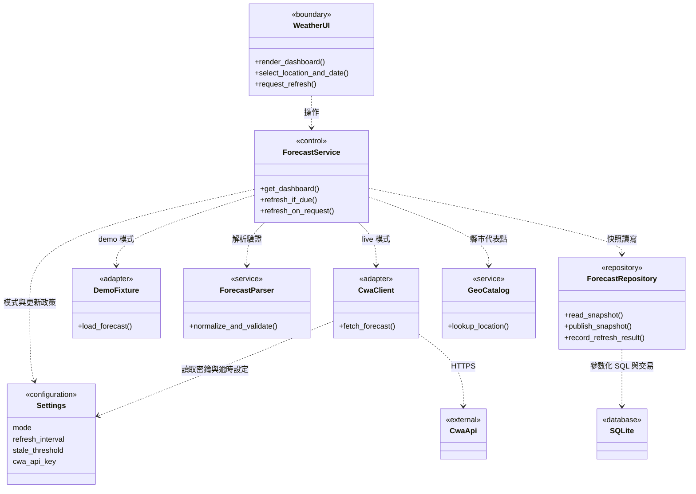
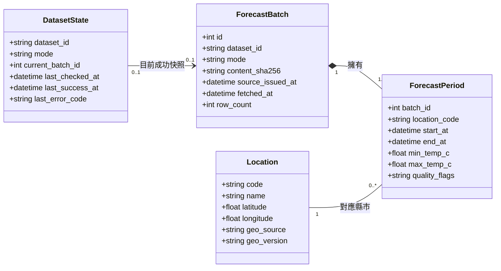
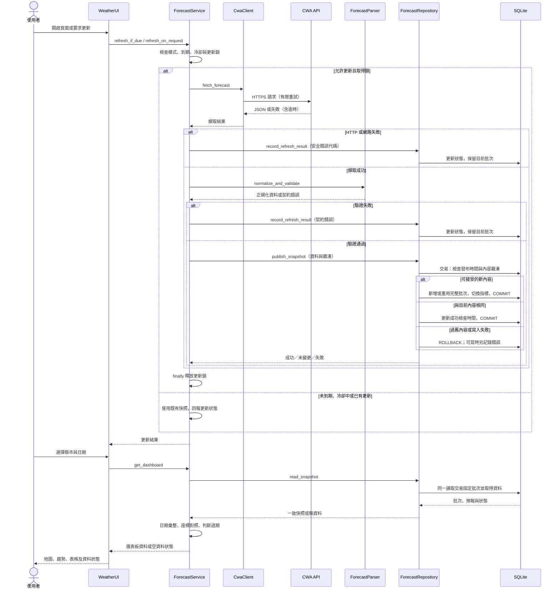
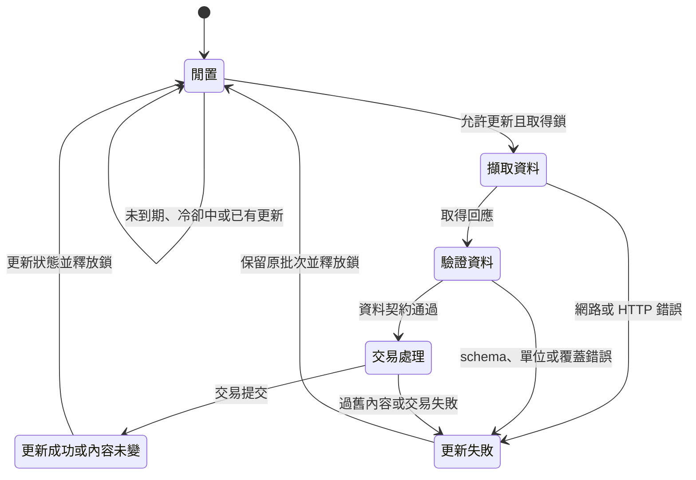

# UML 系統架構規畫

本文件是「縣市一週預報 MVP」的目標設計。目前已實作真實／合成解析器、SQLite、更新流程、JSON 日誌與 Streamlit 介面；圖中類別名稱仍表示責任邊界，實際函式以 src/weather 為準。圖以 Mermaid 表達 UML 類別、循序及狀態模型；名稱是規畫中的責任邊界，方法簽章可在實作時調整。既有需求見 [開發計畫](PLAN.md)，欄位與時間規則見 [架構設計](ARCHITECTURE.md)。

閱讀順序：先看使用情境與模組關係，再看資料模型，最後看更新與失敗處理。

## 1. 角色與系統邊界

| 角色／外部系統 | 主要互動 | 對應需求 |
| --- | --- | --- |
| 一般使用者 | 選縣市／日期、查看地圖／趨勢／表格、要求更新 | FR-04～FR-08 |
| 學習者 | 明確切換至示範模式，以固定範例操作 | FR-09 |
| 維護者 | 設定 Key、部署、檢查更新結果與安全錯誤代碼 | NFR-01、NFR-04、NFR-07 |
| CWA API | 回傳未來預報 JSON | FR-01、FR-02 |
| 底圖服務 | 為瀏覽器提供地圖圖磚；失效時表格仍可用 | FR-07、FR-10 |

MVP 的 Python 模組、Streamlit 與 SQLite 位於同一服務執行個體；瀏覽器是使用者入口。CWA 與底圖供應者在系統之外。這些模組不是微服務，不需要為每個模組新增 HTTP API。API Key 留在伺服器端；定位、通知與即時觀測圖層不屬本次 P0 架構。

## 2. 模組關係：設計類別圖

`boundary` 表示介面邊界、`control` 表示流程協調，其他標籤標示模組責任。虛線箭頭代表「依賴／呼叫」，不是資料的流向。為保持概略，本圖省略方法參數與基礎設施細節。

`WeatherUI` 包含 Streamlit 篩選、Pydeck 地圖、折線圖與表格；它接收同一批次的查詢結果，不自行解析 JSON。`ForecastService` 協調更新與查詢，持有單一更新鎖；一般篩選只查快照，不重新擷取。Demo 來源僅在使用者明確選取時使用。

## 3. 資料結構：領域類別圖

本圖描述資料實體及基數，不是完整 SQL schema。`0..1` 表示可無，`1..*` 表示至少一筆；nullable 欄位與資料約束以圖後說明為準。

- `ForecastBatch` 組合擁有 `ForecastPeriod`：預報時段不能脫離批次存在；只發布完整驗證過的批次。
- `DatasetState` 對每個 `(dataset_id, mode)` 唯一；第一次成功匯入前可沒有目前批次。指向的批次必須具有相同資料集與模式；舊批次不一定有狀態物件指向。
- `ForecastPeriod` 複合鍵為 `(batch_id, location_code, start_at, end_at)`；批次的 `(dataset_id, mode, content_sha256)` 唯一，防止重複匯入。
- 座標、來源發布時間、首次更新前的成功時間／批次指標及缺失的溫度可為 NULL；無錯誤時錯誤代碼可空。圖中的型別不表示必填。
- 時間儲存為 UTC，畫面轉為 Asia/Taipei；最高／最低溫依原始時段對齊。日摘要是查詢結果，不另存成來源事實。
- `schema_migrations` 屬資料庫維護資訊，為保持圖面簡潔未列入領域圖。

## 4. 更新與查詢：循序圖

以下描述 live 模式。更新可能由到期檢查或使用者按鈕觸發，兩者都受到更新鎖與冷卻時間限制。Demo 以固定 fixture 取代 CWA 呼叫，且使用獨立模式的快照。

失敗時使用先前快照；沒有先前快照則顯示「尚無資料」。資料庫本身不可讀時顯示儲存錯誤，不保證仍能讀取舊資料。API Key 不出現在前端或錯誤日誌，所有更新分支都必須釋放鎖。

## 5. 更新生命週期：狀態圖

此圖描述更新工作的狀態；「資料是否過期」由時間與有效區間另外計算，不與更新成功／失敗混成一個狀態。

畫面同時顯示三種獨立資訊：資料模式（live／demo）、可用性（有資料／無資料／過期）及最近更新結果。更新失敗不一定代表舊資料已過期；更新成功也不能讓已超過有效期間的預報重新變成有效。

## 6. 開發對應

| UML 範圍 | 主要實作階段 | 核心驗證 |
| --- | --- | --- |
| Client、Parser、Settings、DemoFixture | M1～M2 | 契約、缺值、逾時與無 Key 測試 |
| Repository、領域實體、更新狀態 | M2 | 冪等、交易回復、模式隔離與快照一致性 |
| Service、UI 的查詢流程 | M3 | 日期彙整及摘要／圖表／表格一致 |
| GeoCatalog、UI 地圖 | M4 | 座標映射、點擊同步與離島顯示 |
| 單一服務部署與 secrets | M5 | 重啟重建、密鑰管理與發布驗收 |

後續若新增即時觀測或多執行個體部署，需另補資料模型與並行控制設計；不直接重用預報時段或單一程序更新鎖。
